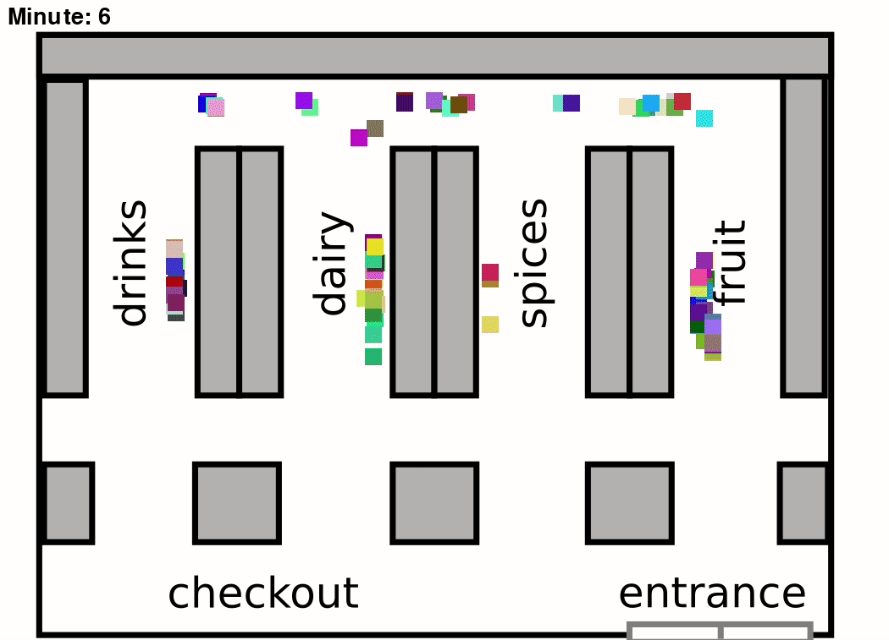
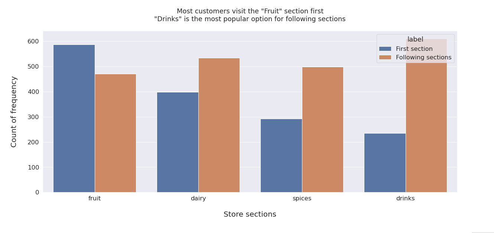
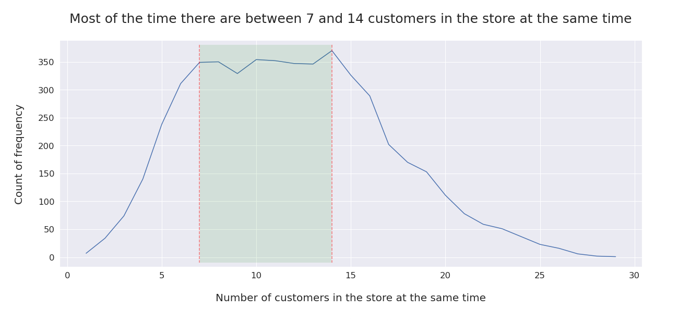
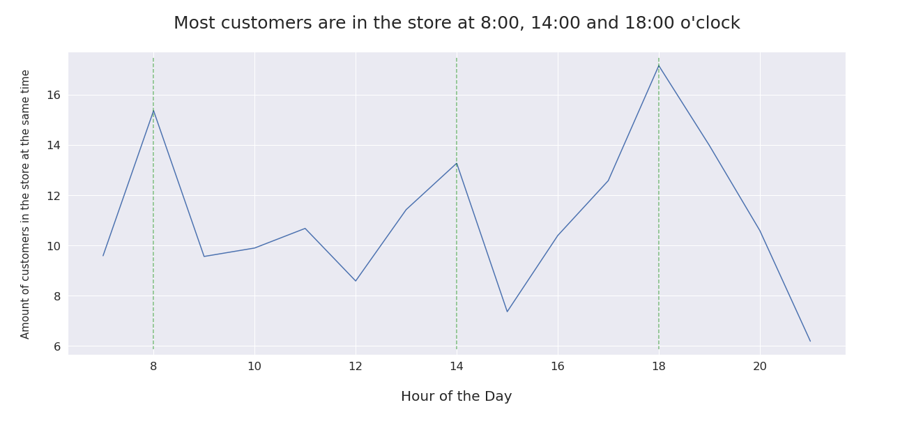

# *Supermarket Simulation*
## Modeling and visualization of the movement of supermarket visitors based on real customer data.

This project uses

- Monte-Carlo Simulation
- Markov-Chain Modeling and
- the Pygame library

to predict movement of customers based on previously captured data. By creating two transition matrices, we can predict the probability of customers to move to a different section of the supermarket while also taking into account the time of the day.

It was written in week 8 of the Spiced Data Science bootcamp in Berlin.

## Visualization of simulated customer-movement:

## EDA:

## Files

- [`eda_and_transition_matrix.ipynb`](eda_and_transition_matrix.ipynb): EDA and creating of transposition matrices
- [`customer_simulation.ipynb`](customer_simulation.ipynb): Simulation and prediction of customer behavior
- [`supermarket_visual.py`](supermarket_visual.py): Visualization of simulated customer-movement
